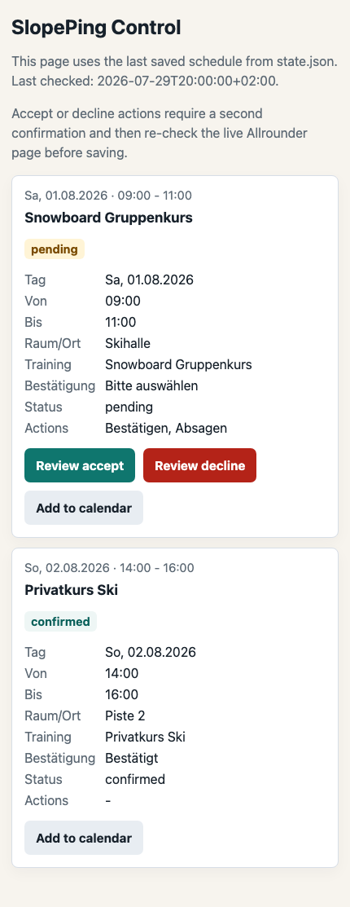
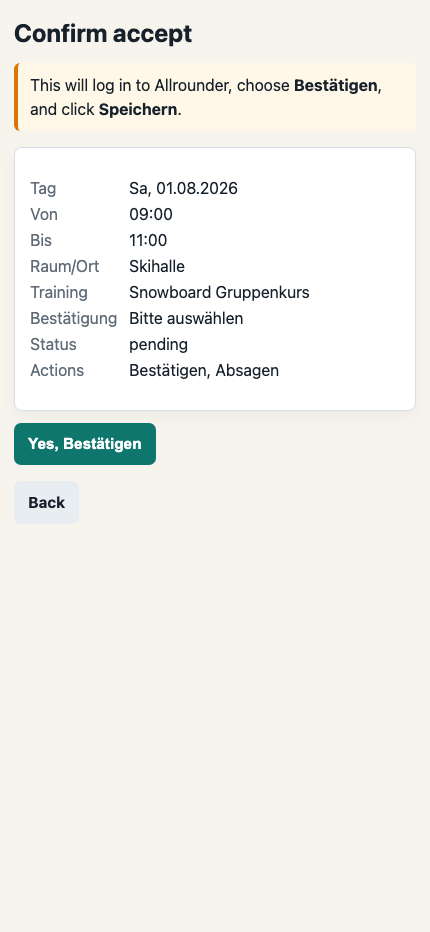

# SlopePing

Sprache: [English](README.md) | [中文](README.zh-CN.md) | Deutsch

SlopePing ist ein kleiner Dienstplan-Watcher für Trainer der Neuss Skihalle.
Er meldet sich im Allrounder-Coach-Portal an, öffnet die Seite
`Arbeitsplan/Verfügbarkeit`, liest die Tabelle `Übersicht` aus und sendet bei
neuen Kursen oder nötigen Bestätigungen eine Benachrichtigung über ntfy an dein
Telefon.

Die erste Version bleibt bewusst einfach: Python, Playwright, lokale `.env`
Konfiguration, `var/state.json` und ntfy-Benachrichtigungen.

## Funktionen

- Öffnet `https://allrounder-jobs.de/login`
- Meldet sich mit `SKI_USERNAME` und `SKI_PASSWORD` an
- Öffnet `Meine Daten` -> `Arbeitsplan/Verfügbarkeit`
- Wechselt zur Planungsseite `https://anmeldung.allrounder.de/do`
- Liest diese Tabellenfelder:
  `Tag`, `Von`, `Bis`, `Raum/Ort`, `Trainingsbezeichnung`, `Bestätigung`
- Erkennt den Bestätigungsstatus:
  `confirmed`, `pending` oder `unknown`
- Markiert Zeilen mit `Bestätigen` / `Absagen` Auswahl als handlungsbedürftig
- Speichert nach jeder erfolgreichen Prüfung einen Screenshot
- Vergleicht aktuelle Kurse mit `var/state.json`
- Sendet ntfy-Benachrichtigungen bei neuen Kursen oder pending Aktionen
- Öffnet über ntfy eine mobile SlopePing-Kontrollseite
- Verlangt eine zweite Bestätigung, bevor remote bestätigt oder abgesagt wird
- Kann Kurse als `.ics` Kalenderdateien exportieren
- Kann im Testmodus bei jedem Lauf einen vollständigen Bericht senden

SlopePing erkennt und meldet handlungsbedürftige Kurse. Es klickt nur nach
einem ausdrücklichen CLI-Befehl oder nach einer zweiten Bestätigung auf der
mobilen Kontrollseite auf `Bestätigen`, `Absagen` und `Speichern`.

In ntfy-Benachrichtigungen erscheint `打开 SlopePing` für die mobile
Kontrollseite.

## Wann die mobile Oberfläche erscheint

Die Oberfläche ist bereits vorhanden. Du musst nicht auf eine echte
Kursänderung warten, um sie anzusehen.

1. Der Checker findet einen neuen oder noch offenen Kurs und sendet eine
   ntfy-Benachrichtigung.
2. `打开 SlopePing` öffnet die Kontrollseite mit dem letzten Stand aus
   `var/state.json`.
3. Offene Kurse zeigen Aktionen zum Prüfen; bestätigte Kurse bieten nur den
   Kalenderexport an.
4. Eine Review-Aktion öffnet eine zweite Bestätigungsseite und ändert noch
   nichts in Allrounder.
5. Erst die letzte Bestätigung meldet sich erneut an, prüft den Live-Status und
   führt die Aktion aus.

Bei laufendem Webhook-Server können neue kurzlebige Links erzeugt werden:

```bash
python scripts/create_webhook_links.py
```

Der langfristige `ACTION_WEBHOOK_TOKEN` darf nicht selbst in eine URL kopiert
werden. Benachrichtigungslinks laufen standardmäßig nach 24 Stunden ab, die
letzte Aktionsbestätigung nach 10 Minuten.

Ohne `var/state.json` bleibt die Seite leer, bis der Checker einmal erfolgreich
gelaufen ist. Die folgenden Screenshots verwenden anonyme Beispieldaten und
die echten Seitentemplates; sie greifen nicht auf Allrounder zu.

Kontrollseite:



Zweite Bestätigung:



Offline-Vorschauen und mobile Screenshots lassen sich neu erzeugen:

```bash
python scripts/generate_ui_previews.py \
  --output output/ui-preview \
  --screenshots output/ui-preview/screenshots
```

Das erzeugte Verzeichnis `output/` wird von Git ignoriert.

## Voraussetzungen

- Python 3.11+
- Ein Allrounder-Coach-Portal-Konto für das Trainersystem der Neuss Skihalle
- Die ntfy App auf dem Telefon oder ein anderer ntfy Client

## Einrichtung

```bash
cd SlopePing
python3.11 -m venv .venv
source .venv/bin/activate
pip install -r requirements.txt
python -m playwright install chromium
cp .env.example .env
```

## `.env` konfigurieren

Bearbeiten:

```bash
nano .env
```

Login-Daten eintragen:

```dotenv
SKI_USERNAME=your_username
SKI_PASSWORD=your_password
```

ntfy eintragen:

```dotenv
NOTIFY_CHANNEL=ntfy
NTFY_SERVER=https://ntfy.sh
NTFY_TOPIC=your-long-private-topic
```

In der ntfy App denselben `NTFY_SERVER` und dasselbe `NTFY_TOPIC` abonnieren.
Das Topic privat halten; wer es kennt, kann es abonnieren.

Für die mobile Kontrollseite Webhook-Werte eintragen:

```dotenv
ACTION_WEBHOOK_TOKEN=your-generated-secure-token
ACTION_WEBHOOK_BASE_URL=http://YOUR_LOCAL_IP:8000
WEBHOOK_HOST=127.0.0.1
WEBHOOK_PORT=8000
```

Für Zugriff vom Telefon im lokalen Netz muss `ACTION_WEBHOOK_BASE_URL` die
lokale IP des Computers verwenden. `WEBHOOK_HOST=0.0.0.0` nur in einem
vertrauenswürdigen Netzwerk setzen.

Es gibt drei Berichtsmodi:

```dotenv
NOTIFY_REPORT_MODE=changes
```

- `changes`: nur bei neuen Kursen oder nötigen Bestätigungen melden.
- `compact`: nach jedem erfolgreichen Lauf einen kurzen Status senden.
- `detailed`: nach jedem erfolgreichen Lauf den vollständigen Diagnosebericht senden.

Wer zu allen drei täglichen Prüfzeiten einen kurzen Status möchte, verwendet
`NOTIFY_REPORT_MODE=compact`.

## Ausführen

Für die mobile Kontrollseite zuerst den Webhook-Server starten:

```bash
cd SlopePing
source .venv/bin/activate
python scripts/webhook_server.py
```

Danach die Prüfung ausführen:

```bash
cd SlopePing
source .venv/bin/activate
python run_checker.py
```

Das Terminal zeigt jeden Schritt: Login, Navigation, Parsing, Screenshot,
Vergleich und Benachrichtigungsstatus.

Wenn ein Kurs pending ist, druckt das Terminal direkt kopierbare Befehle für
diesen Kurs.

Auf dem Handy öffnet `打开 SlopePing` die Kontrollseite. Dort kannst du Kurse
prüfen, Kalenderdateien laden und erst nach einer zweiten Bestätigung annehmen
oder absagen.

Die offiziellen Python-Einstiegspunkte sind `run_checker.py` für Prüfungen und
explizite CLI-Aktionen sowie `scripts/webhook_server.py` für die mobile
Kontrollseite. Die Dateien `scripts/run_*.sh` sind Wrapper für launchd.

## Per CLI bestätigen oder absagen

SlopePing führt eine Bestätigung oder Absage nur aus, wenn du ausdrücklich einen
dieser Befehle startest:

```bash
python run_checker.py --accept "LESSON_KEY_OR_ID"
python run_checker.py --decline "LESSON_KEY_OR_ID"
```

Am einfachsten ist die `lesson_id` aus der ntfy- oder Konsolenmeldung, zum
Beispiel:

```text
17.06.2026|14:00|16:00|Skischule|Extraschicht Skischule
```

`--accept` wählt `Bestätigen`. `--decline` wählt `Absagen`. Danach klickt
SlopePing auf `Speichern`, speichert Vorher-/Nachher-Screenshots und schreibt
`var/actions.log`.

Sicherheitsregeln:

- Nur pending Kurse können bearbeitet werden.
- Wenn Kurs, Dropdown, Aktion oder `Speichern` Button fehlt, gibt SlopePing eine
  klare Fehlermeldung aus und stoppt.
- ntfy-Benachrichtigungen lösen niemals automatisch Aktionen aus.
- Der Webhook-Server hört standardmäßig nur auf `127.0.0.1`. Für Zugriff aus
  dem lokalen Netz setze `WEBHOOK_HOST=0.0.0.0` nur in einem vertrauenswürdigen
  Netzwerk und verwende die lokale IP in `ACTION_WEBHOOK_BASE_URL`.

## Laufzeitdateien

- `var/state.json`: zuletzt bekannter Kursstand
- `var/state.json.bak`: Sicherung des vorherigen gültigen Zustands
- `var/health.json`: letzter Lauf, Fehler- und Leerresultatstatus
- `var/actions.log`: Historie manueller Bestätigungen und Absagen
- `var/calendar_events/`: Kalenderdateien aus Webhook-Aktionen
- `var/screenshots/`: Erfolgs- und Fehler-Screenshots
- `var/logs/`: Checker-, Webhook- und launchd-Protokolle

Alle werden von Git ignoriert.

## Schutz für unbeaufsichtigten Betrieb

- Checker, CLI- und Webhook-Aktionen teilen eine prozessübergreifende Sperre.
- Das erste unerwartete leere Ergebnis behält den alten Zustand; erst die
  zweite gültige leere Tabelle bestätigt ihn.
- Normale Prüfungen wiederholen begrenzte Playwright-/Netzwerkfehler.
  Bestätigen und Absagen werden niemals automatisch wiederholt.
- Erster Fehler, Fehlerschwelle und spätere Erholung erzeugen Statusmeldungen.
- Screenshots und Kalenderdateien haben standardmäßig 30 Tage Aufbewahrung;
  Protokolle rotieren ab 5 MB.
- Finale Aktionstoken sind an Kurs und Aktion gebunden und nicht wiederverwendbar.

## Entwicklung und Prüfungen

Festgeschriebene Entwicklungsabhängigkeiten und Chromium installieren und
anschließend den einheitlichen Prüfbefehl ausführen:

```bash
source .venv/bin/activate
pip install -r requirements-dev.txt
python -m playwright install chromium
./scripts/check.sh
```

Der Befehl prüft Ruff-Formatierung und Lint, mypy und pytest. Parser-Tests
verwenden anonymisierte HTML-Dateien aus `tests/fixtures/` in einem lokalen
Headless-Chromium und greifen nicht auf das echte Portal zu. GitHub Actions
führt denselben Befehl aus.

## Fehlerbehebung

- Login schlägt fehl: `SKI_USERNAME` und `SKI_PASSWORD` prüfen.
- Seite öffnet, aber keine Kurse werden gelesen: `var/screenshots/` und
  `var/health.json` prüfen.
- Terminal meldet ntfy gesendet, aber das Telefon bleibt stumm:
  Benachrichtigungsrechte, Server und Topic prüfen.
- Benachrichtigung ohne neuen Kurs testen:
  `NOTIFY_REPORT_MODE=compact` setzen.
- Wenn ein Kurs eine Aktion braucht, zeigt die Benachrichtigung Anzahl, Zeit,
  Kurs, Ort und Status.

## Weitere Details

Implementierungsdetails stehen separat:

- [Architecture notes, English](docs/architecture.en.md)
- [架构说明，中文](docs/architecture.zh-CN.md)
- [Architekturhinweise, Deutsch](docs/architecture.de.md)
